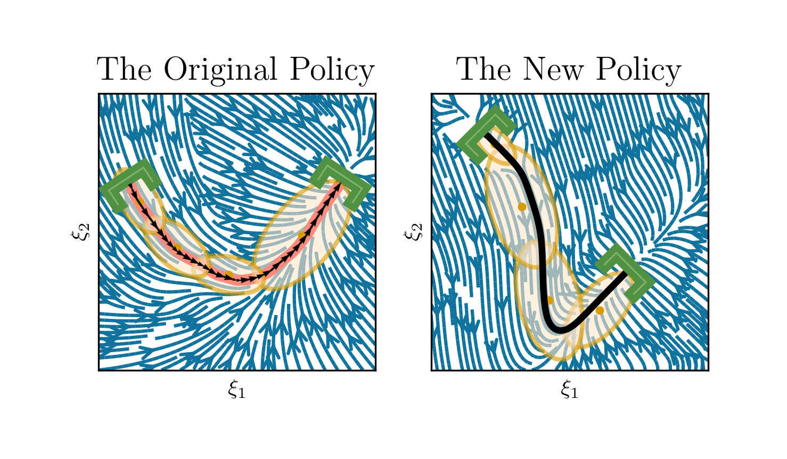
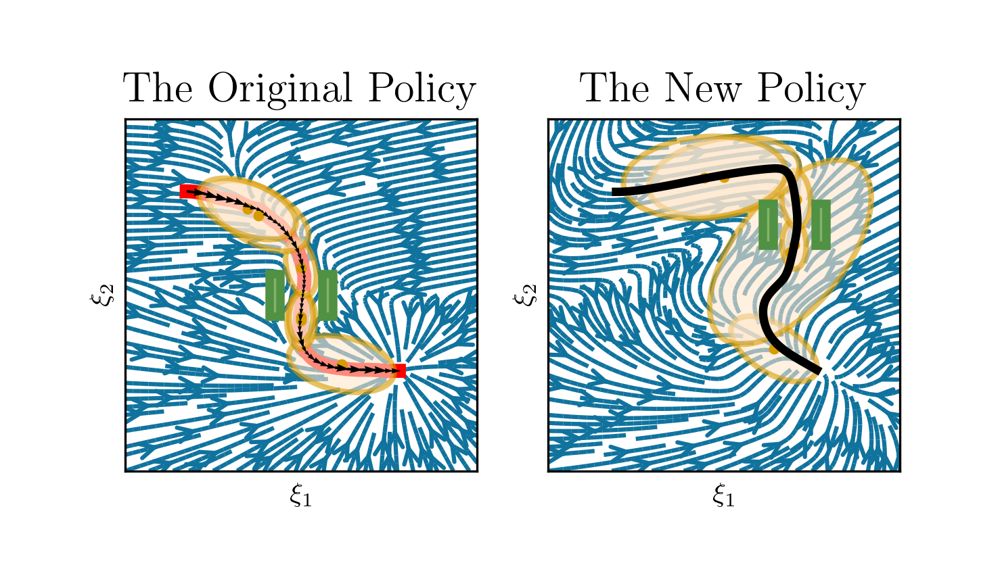

# Elastic-DS


| [Website](https://sites.google.com/view/elastic-ds) | [Paper](https://openreview.net/forum?id=8scj3Y0RLq) | [Spotlight Video](https://drive.google.com/file/d/1K5L5L5HX8itEsBO4XEUmkS3pbgBMwgru/view?usp=drive_link) |

This is the code example for the Paper <i>Task Generalization with Stability Guarantees via Elastic Dynamical System Motion Policies</i> accepted to CoRL 2023. This repo contains 2D example for adapting to endpoints and continuous via-point. The GMM here adapts the [DAMM](https://arxiv.org/abs/2309.02609) method, which provides lightspeed estimation of GMM and automatically determine the number of Gaussians. Another option is to use [PC-GMM](https://github.com/nbfigueroa/phys-gmm).

### Endpoints

```
python -m task.main_start_end --test 2
```



### Via-Point
```
python -m task.main_via --test 1
```



### BibTeX
If you find this code useful for you project, please consider citing it.
```
@article{li2023task,

    title={Task Generalization with Stability Guarantees via Elastic Dynamical System Motion Policies}, 

    author={Tianyu Li and Nadia Figueroa},

    year={2023},

    eprint={2309.01884},

    archivePrefix={arXiv},

    primaryClass={cs.RO}

}
```


